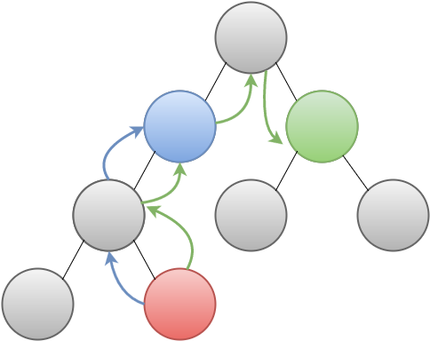

# react-redux

Created: Jun 2, 2021 8:13 AM
Tags: React

## 개요

- 순수 `React`는 부모 자식간의 데이터를 주고 받을 때 한 단계씩 거치게된다.
- `redux`를 적용하게 되면 `store`에 그 데이터를 저장하고 읽을 수 있으므로 여러 단계의 통신을 한 단계로 줄일 수 있다.



redux가 없는 구조


redux가 있는 구조

## redux 특징

- 상태를 저장하는 `store`는 단 한 개만 존재
- state를 변경하는 유일한 방법은 `dispatch` 하는 것
- `reducer`는 순수 함수로 `action`과 `state`를 받아서 새로운 `state`를 만듦


## redux 적용

## `store` & `reducer` 생성

```jsx
const userReducer = () => {
  return { name: 'Tom' };
}
 
const store = createStore(userReducer);
 
console.log(store, store.getState());
```

- `store` 최초 생성시 `reducer` 초기화
- `store.getState()` 에서는 `reducer` 함수를 실행하고 `{ name: 'Tom' }` 이라는 초기 `state`를 불러옴

## `action` & `dispatch`

```jsx
const userReducer = (state, action) => {
  console.log(action);
  if (action.type === 'UPDATE_USER') {
    return { ...state, name: action.payload};
  }
  return state;
}
 
const store = createStore(userReducer);
 
console.log(store, store.getState());
 
const action = {
  type: 'UPDATE_USER',
  payload: 'Jane'
}
 
store.dispatch(action);
```

- `UPDATE_USER` 라는 `action`이 호출되면 `userReducer`의 `state`는 `{ name: 'Jane' }` 으로 바뀜

## `subscribe`

```jsx
store.subscribe(() => console.log(store.getState()));
 
store.dispatch(action);
```

- `state`가 변경될 때 마다 `subscribe`가 호출된다.

## `redux devtools`

```jsx
const store = createStore(reducer, window.__REDUX_DEVTOOLS_EXTENSION__ && window.__REDUX_DEVTOOLS_EXTENSION__());
```

- `createStore`의 두 번째 파라메터를 위와 같이 넘겨주면 크롬 확장 프로그램 `redux devtools`사용 가능

## `reducer` 추가

```jsx
import {combineReducers, createStore} from 'redux';
 
const userReducer = (state, action) => {
  console.log(action);
  if (action.type === 'UPDATE_USER') {
    return { ...state, name: action.payload};
  }
  return state;
}
 
const counterReducer = (state = initialState, action) => {
  switch(action.type) {
    case 'INCREASE':
      return state + 1;
    case 'DECREASE':
      return state - 1;
    default:
      return state;
  }
}
 
const allReducer = combineReducers({
  count: counterReducer,
  user: userReducer
})
 
 
const store = createStore(allReducers, window.__REDUX_DEVTOOLS_EXTENSION__ && window.__REDUX_DEVTOOLS_EXTENSION__());
```

- `counterReducer`를 추가하고 `combineReducers`로 두 `reducer`를 묶음
- `store`를 생성 후 `store.getState()`의 결과물 :

    ```json
    {
      count: 0,
      user: { name: 'Tom' }
    }
    ```

## react-redux 적용

## `provider`

```jsx
ReactDOM.render(
  <provider store="{store}"><app></app></provider>,
  document.getElementById('root')
);
```

- `store`를 리액트에 주입하기 위해 `provider` 사용

## `ducks` 패턴

- `action type`, `action creator`, `reducer`를 하나의 파일에 보관

```jsx
// action type: 스트링, 모듈명/액션타입으로 표시
export const UPDATE_USER = 'user/UPDATE_USER';
 
// action creator: 액션을 동적으로 생성하는 펑션
export const updateUser = (name) => ({
  type: UPDATE_USER,
  payload: name
});
 
const initialState = {
  name: 'Tom'
};
 
export const userReducer = (state = initialState, action) => {
  switch(action.type) {
    case UPDATE_USER:
      return { ...state, name: action.payload };
    default:
      return state;
  }
}
```

```jsx
// action type: 스트링, 모듈명/액션타입으로 표시
export const INCREASE = 'counter/INCREASE';
export const DECREASE = 'counter/DECREASE';
 
// action creator: 액션을 동적으로 생성하는 펑션
export const increaseCount = () => ({
  type: INCREASE
});
 
export const decreaseCount = () => ({
  type: DECREASE
});
 
const initialState = 0;
 
export const counterReducer = (state = initialState, action) => {
  switch(action.type) {
    case INCREASE:
      return state + 1;
    case DECREASE:
      return state - 1;
    default:
      return state;
  }
}
```

```jsx
import {combineReducers} from "redux";
import {userReducer} from "./userReducer";
import {counterReducer} from "./counterReducer";
 
export const allReducer = combineReducers({
  count: counterReducer,
  user: userReducer
})
```

```jsx
import {createStore} from "redux";
import {allReducers} from "./reducers";
 
export const store = createStore(allReducers, window.__REDUX_DEVTOOLS_EXTENSION__ && window.__REDUX_DEVTOOLS_EXTENSION__());
```

```jsx
import {Provider} from "react-redux";
import {store} from "./store";
import {updateUser} from "./actions";
 
ReactDOM.render(
  <provider store="{store}"><app></app></provider>,
  document.getElementById('root')
);
```

## State 변경 및 바인딩 테스트

```jsx
function App() {
  const count = useSelector(state => state.count);
  const user = useSelector(state => state.user);
  const dispatch = useDispatch();
 
  return (
    <div className="App">
      <Counter count={count} onIncrease={() => dispatch(increaseCount())} onDecrease={() => dispatch(decreaseCount())}></Counter>
      <User name={user.name} updateUser={(name) => dispatch(updateUser(name))}></User>
    </div>
  );
}
 
export default App;
```

- `useSelector`: `store`의 `state`를 가져올 수 있는 hook
- `useDispatcher`: `action`을 `dispatch` 하는 hook

## 참고

[https://eastflag.co.kr/react/scoreboard-advanced/react-redux-tutorial/](https://eastflag.co.kr/react/scoreboard-advanced/react-redux-tutorial/)