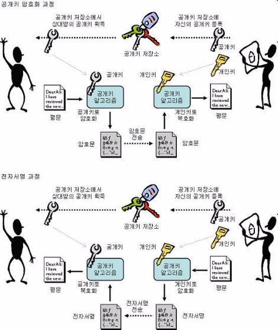

# HTTPS

Created: Jun 14, 2021 3:14 PM
Tags: Security, Web

# HTTP

- `HTTP(HyperText Transfer Protocol)`: 웹 브라우저와 서버 간의 자원을 주고 받을 때 쓰는 프로토콜
- plain text 교환으로 누군가 네트워크에서 신호를 가로채어 본다면 내용이 노출됨

# HTTPS

- `SSL(Secure Socket Layer)` 프로토콜을 이용하여 웹프라우저와 서버가 데이터를 주고 받는 통신 규약
- `HTTP` 메세지를 암호화함
- 공개키 암호화 방식을 사용

# 공개키 암호화 알고리즘

## 대칭 키 알고리즘

- 대칭키 알고리즘은 데이터를 송신, 수신하는 사람 모두 같은 키를 가지고 메세지를 암호화/복호화함.
- 대칭키 알고리즘은 키를 교환하는 과정에 있어서 다른 사용자가 키를 가로 채서 메세지를 볼 수 있음

## 공개키 알고리즘

- 공개키 알고리즘은 메세지를 서로 다른 키를 가지고 암호화/복호화 함
    1. A라는 사람이 공개키와 개인키를 가지고 있음
    2. B라는 사람이 공개키 저장소에서 A라는 사람의 공개키를 가지고 옴
    3. 가져온 공개키로 메세지를 암호화함
    4. 메세지를 A에게 송신
    5. 해당 암호문은 A의 개인키로만 복호화할 수 있음

    

# HTTPS의 통신 흐름

- 공개키 저장소는 CA(Certificate Authority)라고 불리는 신뢰성이 검증된 기업이 운영하는 저장소
- CA는 검증된 기업이기에 A와 B 모두 신뢰할 수 있음
- 통신 흐름
    1. 애플리케이션 서버 기업은 HTTPS를 적용하기 위해 공개키와 개인키를 만듦
    2. 신뢰할 수 있는 CA를 선택하고 공개키 관리 계약을 함
    3. CA는 CA만의 공개키와 개인키가 있음
    4. CA의 개인키로 암호화해서 A서버의 공개키, 공개키 암호화 방법 등의 정보를 담은 인증서를 만들고 해당 인증서를 CA 개인키로 암호화해서 A 서버에 제공
    5. A서버의 공개키로 암호화된 요청(NO HTTPS)이 오면 암호화된 인증서를 클라이언트에게 줌
    6. 클라이언트는 HTTPS 요청이 아니기 때문에 CA 기업의 개인 키로 암호화한 인증서를 받게됨
    7. 세계적으로 신뢰할 수 있는 CA 기업의 공개키는 브라우저가 이미 알고 있음
    8. CA 기업의 공개키로 복호화하여 A 서버의 공개키를 얻음
    9. A서버와 통신할때는 이제 A 서버의 공개키로 암호화해서 통신하게됨

# 참고

- [https://jeong-pro.tistory.com/89](https://jeong-pro.tistory.com/89)(https://jeong-pro.tistory.com/89](https://jeong-pro.tistory.com/89)
- [https://www.freecodecamp.org/news/https-explained-with-carrier-pigeons-7029d2193351/](https://www.freecodecamp.org/news/https-explained-with-carrier-pigeons-7029d2193351/)